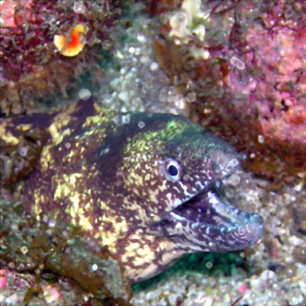

# Physics-Inspired Synthesized Marine Snow Image Dataset and Physics-Inspired Synthesized Underwater Image Dataset
Welcome to Physics-Inspired Synthesized Marine Snow Image Dataset (PHISMID in short) and Physics-Inspired Synthesized Underwater Image Dataset (PHISWID in short).

  
*An example from Physics-Inspired Synthesized Marine Snow Image Dataset. Left: Original underwater image. Right: Synthesized image.*

  
*An example from Physics-Inspired Synthesized Underwater Image Dataset. Left: Original underwater image. Right: Synthesized image.*

PHISWID is tailored to enhance underwater image processing through physics-inspired image synthesis. PHISWID showcases ***color degradation*** and the often-neglected effects of ***marine snow***, a composite of organic matter and sand particles. PHISMID showcases ***marine snow***. We mathematically model the light scattering of marine snow through physics-based underwater image observation model. The modeled artifacts are synthesized with underwater images and construct large-scale pairs of ground-truth and degraded images to calculate objective qualities for underwater image enhancement and to train a deep neural network.

## References
If you use PHISMID or PHISWID in your paper, please cite the following paper. The details for synthesizing marine snow artifacts are also described.
  1. [R. Kaneko, H. Higashi, and Y. Tanaka, "Physics-Inspired Synthesized Underwater Image Dataset" preprint on arXiv, 2024.](https://arxiv.org/abs/2404.03998)

## Dataset Descriptions
**PHISMID**: Designed for marine snow removal  
**PHISWID**: Designed for underwater image enhancement/restoration as well as marine snow removal

### PHISMID Specifications
PHISMID contains 400 image pairs, all having a pixel resolution of 384 x 384. All original underwater images are collected from [flickr](https://www.flickr.com) under Creative Commons Attribution-NonCommercial-ShareAlike 2.0 Generic(CC BY-NC-SA 2.0) License and CC BY 2.0. It consists of an original underwater image and that contains synthesized marine snow artifacts.

### PHISWID Specifications
PHISWID contains 4195 image pairs, all having a pixel resolution of 1344 x 756. All original atmospheric RGB-D images used for PHISWID are collected from [large-scale RGB-D database]([https://paperswithcode.com/dataset/rmrc-2014]). An image pair contains one original atmospheric image and one synthesized underwater image degraded by color shift ([ueda et al.](https://ieeexplore.ieee.org/abstract/document/8803195)) and marine snow artifacts.

## Downloading PHISMID and PHISWID
You can download PHISMID and PHISWID from [Google Drive](https://drive.google.com/drive/folders/12H3M-N62GykBguOO-ojujbWxmZF45P0W?usp=sharing). The file is zipped. After unzipping, you can find *original* and *degraded* directories.

The images in *original* are real underwater images without marine snow or atmospheric images, i.e., ground-truth images. Those in *degraded* are degraded images with synthesized marine snow artifacts or synthesized color shift and marine snow artifacts.

## Examples from PHISMID
The images below are examples of PHISMID.
|Original underwater image| Synthesized images with marine snow|
|---|---|
| |  |
| |  |
| |  |

## Examples from PHISWID
The images below are examples of PHISWID.
|Original underwater image| Synthesized images with color shift and marine snow|
|---|---|
| |   |
| |  |
| |  |

## Benchmarking Results on Synthesized Images
The following tables are the current state-of-the-art results for marine snow removal. The average PSNRs/SSIMs are computed over the test datasets. If you would like to update the results, [please let us know](<mailto:r.kaneko@msp-lab.org>)!!

### PHISMID Results
|Method   | PSNR  | SSIM  |
|---|---|---|
|Median filter (kernel size 3x3)   |  30.10 | 0.9907  |
|Median filter (kernel size 5x5)   |  29.73 | 0.9886  |
|Adaptive median filter (kernel size 3x3)   | 30.40  | 0.9877  |
|Adaptive median filter (kernel size 5x5)   | 30.42  | 0.9878  |
|U-Net   | **37.25**  | **0.9930**  |
|Synthesized image   | 30.63  | 0.9873  |

### PHISWID Results
|Method   | PSNR  | SSIM  |
|---|---|---|
|Transformer(UIEB) ([C Li et al.](https://ieeexplore.ieee.org/document/8917818))   |14.69   | 0.286  |
|Transformer(LSUI) ([L Peng et al.](https://ieeexplore.ieee.org/abstract/document/10129222))   |15.06  | 0.363  |
|Transformer(PHISWID)   | **21.00**  | **0.793**  |
|Synthesized image   | 13.67  | 0.120  |

## Restoration Results
The images below are restoration examples for both datasets.

### PHISMID Results
|Median filter  | Adaptive median filter  | U-Net  |
|---|---|---|
| |   |   |
| |  | |
| |  | |

### PHISWID Results
| Transformer(UIEB) | Transformer(LSUI)  | Transformer(PHISWID)  |
|---|---|---|
| |   | |
| |  | |
| |  | |

## Copyright
Copyright (c) 2024 Reina Kaneko, Hiroshi Higashi, and Yuichi Tanaka.

