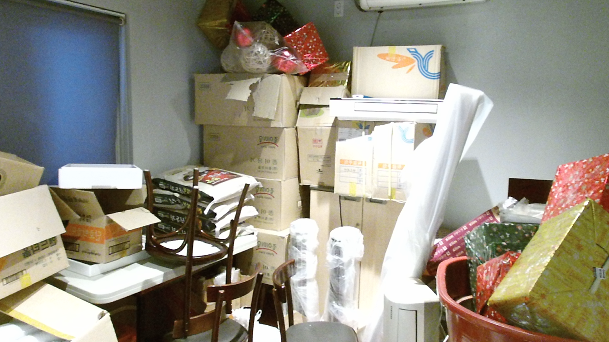
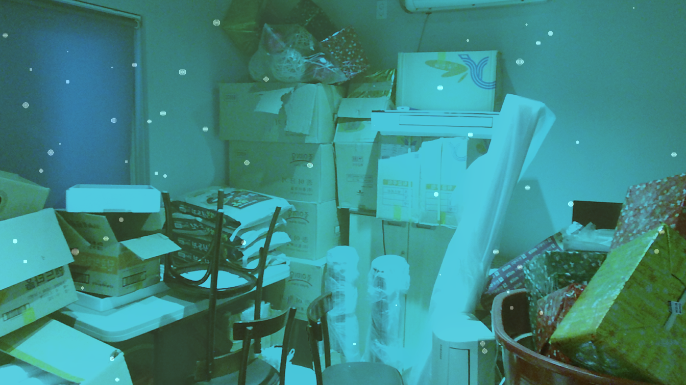

# Physics-Inspired Marine Snow Image Dataset and Physics-Inspired Underwater Image Dataset
Welcome to Physics-Inspired Marine Snow Image Dataset(PHISMID in short) and Physics-Inspired Underwater Image Dataset(PHISWID in short).

   
*An example from Physics-Inspired Marine Snow Image Dataset. Left: Original underwater image. Right: Synthesized image.*

   
*An example from Physics-Inspired Underwater Image Dataset. Left: Original underwater image. Right: Synthesized image.*

PHISWID is tailored to enhance underwater image processing through physics-inspired image synthesis. PHISWID showcases ***color degradation*** and the often-neglected effects of ***marine snow***, a composite of organic matter and sand particles. PHISMID showcases ***marine snow***. We mathematically model the light scattering of marine snow through physics-based underwater image observation model. The modeled artifacts are synthesized with underwater images and construct large-scale pairs of ground-truth and degraded images to calculate objective qualities for marine snow removal and to train a deep neural network.

## References
If you use PHISWID in your paper, please cite the following paper. The details for synthesizing marine snow artifacts are also described.
  1. [R. Kaneko, H. Higashi, and Y. Tanaka, "Physics-Inspired Synthesized Underwater Image Dataset"](https://arxiv.org/abs/2404.03998)

## Dataset Descriptions
**PHISMID**: Designed for marine snow removal  
**PHISWID**: Designed for underwater image enhancement/restoration as well as marine snow removal

Clearly, image enhancement with PHISWID is more difficult than PHISMID, but PHISMID itself is also beneficial for the overlooked marine snow removal task.

### PHISMID Specifications
PHISMID contains 400 image pairs, all having a pixel resolution of 384 x 384. All original underwater images are collected from [flicker](https://www.flickr.com) under Creative Commons Attribution-NonCommercial-ShareAlike 2.0 Generic(CC BY-NC-SA 2.0) License and CC BY 2.0. It consists of an original underwater image and that contains synthesized marine snow artifacts.

### PHISWID Specifications
PHISWID contains 2264 image pairs, all having a pixel resolution of 384 x 384. All original atmospheric RGB-D images used for PHISWID are collected from NYD-RGB dataset and an outdoor image dataset. An image pair contains one original atmospheric image and one synthesized underwater image degraded by color shift ([ueda et al.](https://ieeexplore.ieee.org/abstract/document/8803195)) and marine snow artifacts.

## Downloading PHISMID and PHISWID
You can download PHISMID and PHISWID from [Google Drive](<https://drive.google.com/drive/folders/0ANDhHoSp5QZvUk9PVA>). The file is zipped. After unzipping, you can find *original* and *snow* directories.

The images in *original* are real underwater images without marine snow or atmospheric images, i.e., ground-truth images. Those in *snow* are degraded images with synthesized marine snow artifacts or synthesized color shift and marine snow artifacts.

## Examples from PHISMID
The images below are examples from the test data of PHISMID.
|Original underwater image| Synthesized images for PHISMID tasks|
|---|---|
| |   |
| |  |
| |  |

## Examples from PHISWID
The images below are examples from the test data of PHISWID.
|Original underwater image| Synthesized images for PHISWID tasks|
|---|---|
| |   |
| |  |
| |  |

## Benchmarking Results on Synthesized Images
The following tables are the current state-of-the-art results for marine snow removal. The average PSNRs/SSIMs are computed over the test datasets. If you would like to update the results, [please let us know](<mailto:r.kaneko@msp-lab.org>)!!

### PHISMID Results
|Method   | PSNR  | SSIM  |
|---|---|---|
|Median filter (kernel size 3x3)   |  30.10 | 0.9907  |
|Median filter (kernel size 5x5)   |  29.73 | 0.9886  |
|Adaptive median filter (kernel size 3x3)   | 30.40  | 0.9877  |
|Adaptive median filter (kernel size 5x5)   | 30.42  | 0.9878  |
|U-Net   | **37.25**  | **0.9930**  |
|Synthesized image   | 30.63  | 0.9873  |

### PHISWID Results
|Method   | PSNR  | SSIM  |
|---|---|---|
|Deep WaveNet(UIEB)   |17.73  | 0.076  |
|Water Net(UIEB)   |14.35   | 0.064  |
|U-shape(LSUI)   |19.77  | 0.397  |
|U-Net   | **23.52**  | **0.692**  |
|Synthesized image   | 17.35  | -0.120  |

## Restoration Results
The images below are restoration examples for both datasets.

### PHISMID Results
|Median filter  | Adaptive median filter  | U-Net  |
|---|---|---|
| |   |   |
| |  | |
| |  | |

### PHISWID Results
|Deep WaveNet  | Water Net  | U-shape  | U-Net  |
|---|---|---|---|
| |   |   |  |
| |  | |  |
| |  | |  |

## Copyright
Copyright (c) 2024 Reina Kaneko, Hiroshi Higashi, and Yuichi Tanaka.

We would like to thank all users on flickr who made original underwater images available under the CC BY-NC-SA 2.0 license. Credits of all the images in PHISMID and PHISWID are available in this repository through img_user_id.csv. Please let us know if you have any questions and comments on this dataset.

